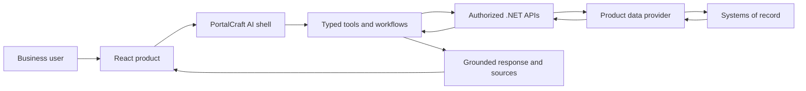

# Architecture and reuse

## What is reusable

The reusable substrate is independent of the sample request domain:

- conversation shell and mode navigation
- installation-time assistant and host-product branding
- selected-entity context across follow-up turns
- typed request and response contracts
- deterministic intent routing
- source metadata and grounded result cards
- validated navigation actions
- mutation blocking and explicit safety boundaries
- frontend and backend test patterns

## What a product replaces

An adopting product supplies:

1. **Entity contracts** — orders, incidents, cases, requests, assets, or another domain.
2. **Data provider** — repository implementations backed by its APIs or systems of record.
3. **Tool registrations** — supported read-only intents and required parameters.
4. **Routes and views** — application-owned search, details, and queue locations.
5. **Authorization** — product roles and policies enforced by the .NET backend.
6. **Workflow definitions** — safe multi-step journeys and confirmation boundaries.

The included `RequestRepository` is an in-memory provider. Replace it with an interface and an implementation for SQL, REST, GraphQL, SAP, ServiceNow, Dynamics, or another enterprise source without changing the React conversation model.

## Repository onboarding tool

`PortalCraft.RepoTool` provides a safe starting point for a new product:

1. It scans source files without executing repository code.
2. It inventories ASP.NET Core minimal APIs, controller actions, frontend API calls, and React routes.
3. It creates query candidates for `GET` operations and clearly named read-only
   POST search/filter/lookup/query endpoints, while excluding mutation verbs.
4. It generates a JSON evidence manifest, a typed .NET catalog endpoint, TypeScript descriptors,
   and a reusable React prompt panel in a separate output directory.
5. Product owners review the output and implement authorized handlers against their domain APIs.

Discovery cannot infer business authorization, data sensitivity, or every natural-language
variant. Generated files therefore remain onboarding scaffolding rather than an automatic
authorization or data-access layer.

The tool also supports `pr-scenarios`. It reads recent first-parent Git history from a
selected branch, inventories each merged change's files, and creates prioritized UI, API,
security, data, and regression scenarios. This remains static planning evidence: scenario
execution belongs in the product's established unit, integration, API, and Playwright suites.

## Responsibility boundaries

| Layer | Responsibility |
|---|---|
| React application | Current route, visible entity context, conversation UI, confirmations, and validated navigation |
| PortalCraft AI | Intent routing, typed tool selection, workflow continuity, response formatting, and source presentation |
| .NET API | Authentication, authorization, business rules, data access, auditing, and stable contracts |
| Product provider | Maps product-specific APIs and records into PortalCraft AI contracts |
| Systems of record | Authoritative business data and workflow state |

## Safety model

- Tool inputs are validated before execution.
- Query tools are read-only.
- Routes and UI actions are application-owned.
- Multiple results require explicit user selection.
- Missing identifiers produce clarification instead of guessed data.
- A request without a review ticket is reported as such.
- Approve, reject, submit, delete, and discard are intentionally excluded.
